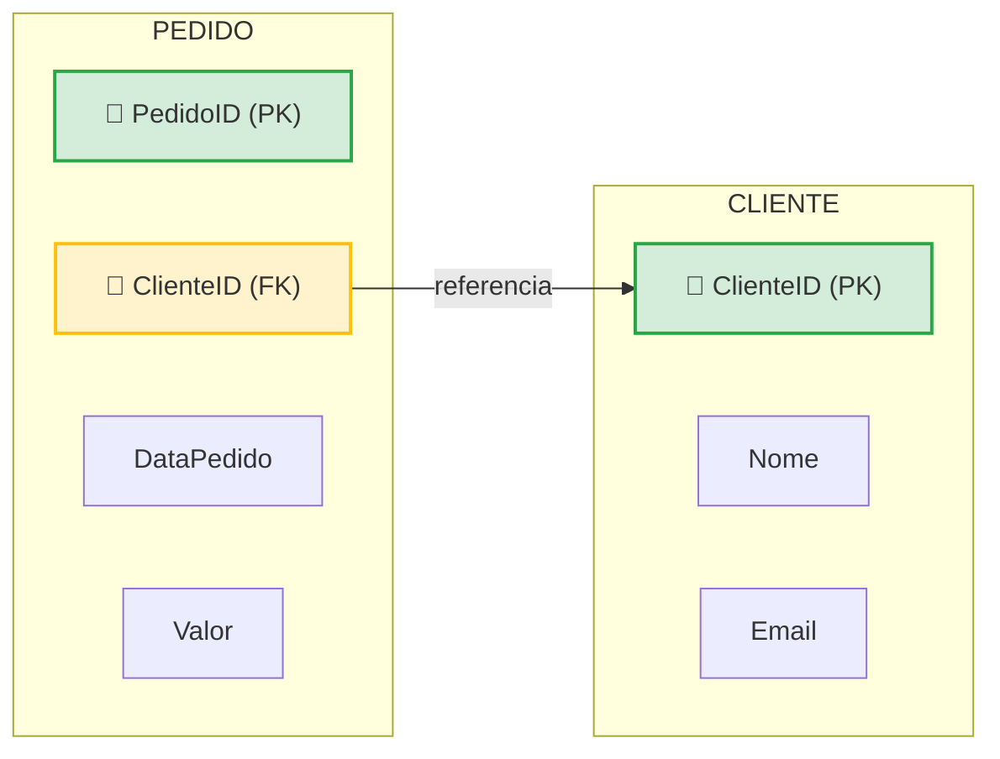

# 2.1 — Conceitos de Dados Relacionais

> No **modelo relacional**, os dados são organizados em **tabelas** (também chamadas de *relações*), que representam coleções de entidades do mundo real. É o modelo mais usado para dados estruturados.

---

## Estrutura de uma Tabela

| Elemento | Também chamado de | O que é |
|----------|-------------------|---------|
| **Tabela** | Relação | Conjunto de dados sobre um tipo de entidade (clientes, produtos) |
| **Linha** | Registro / tupla | Uma instância da entidade (um cliente específico) |
| **Coluna** | Campo / atributo | Uma propriedade da entidade (nome, cidade) |

**Exemplo — tabela `Produto`:**

| ProdutoID | Nome | Preco |
|-----------|------|-------|
| 1 | Teclado | 120.00 |
| 2 | Mouse | 80.00 |

---

## Características do Modelo Relacional

- Toda tabela tem um **esquema fixo**: colunas e tipos definidos antecipadamente.
- Cada coluna tem um **tipo de dado** (inteiro, decimal, texto, data, booleano...).
- A **ordem das linhas não importa** — elas são identificadas pelo conteúdo, não pela posição.
- Cada linha deve ser **única** e identificável.
- Os relacionamentos entre tabelas são feitos por **chaves**, não por links físicos.

---

## Chaves

| Chave | Função |
|-------|--------|
| **Chave primária** (*primary key*) | Coluna (ou conjunto) que **identifica unicamente** cada linha. Não pode repetir nem ser nula. |
| **Chave estrangeira** (*foreign key*) | Coluna que **referencia a chave primária** de outra tabela, criando o relacionamento. |
| **Índice** (*index*) | Estrutura que acelera a busca por valores em uma ou mais colunas. |

**Exemplo de relacionamento:** a tabela `Pedido` tem a coluna `ClienteID` como **chave estrangeira**, apontando para a **chave primária** `ClienteID` da tabela `Cliente`.

> Leitura: a coluna `ClienteID` (FK) da tabela **PEDIDO** aponta diretamente para a coluna `ClienteID` (PK) da tabela **CLIENTE** — é assim que o banco sabe a qual cliente cada pedido pertence.

---

## Integridade dos Dados

O modelo relacional protege a qualidade dos dados com regras de integridade:

- **Integridade de entidade** — a chave primária é única e não nula.
- **Integridade referencial** — uma chave estrangeira só pode apontar para um valor que **existe** na tabela referenciada.
- **Integridade de domínio** — os valores respeitam o tipo e as restrições da coluna.

---

## Vantagens e Limitações

| Vantagens | Limitações |
|-----------|------------|
| Consistência e integridade fortes | Esquema rígido — mudanças são custosas |
| Linguagem padrão (SQL) | Escala horizontal mais difícil |
| Elimina redundância (normalização) | Menos eficiente para dados não estruturados |
| Amplamente conhecido e suportado | |

---

## Pontos-Chave para o Exame

- ✅ Tabela = **linhas** (registros) × **colunas** (atributos), com **esquema fixo**.
- ✅ **Chave primária** identifica a linha; **chave estrangeira** liga tabelas.
- ✅ **Integridade referencial** garante que a chave estrangeira aponte para um valor existente.
- ✅ Cada coluna tem um **tipo de dado** definido.

## Documentação Oficial (pt-BR)

- [Explorar dados relacionais no Azure](https://learn.microsoft.com/pt-br/training/paths/azure-data-fundamentals-explore-relational-data/)
- [Explorar conceitos de dados relacionais](https://learn.microsoft.com/pt-br/training/modules/explore-relational-data-offerings/)

---

[← Voltar ao módulo](./README.md) | [Próxima aula → 2.2](./2.2-normalizacao.md)
